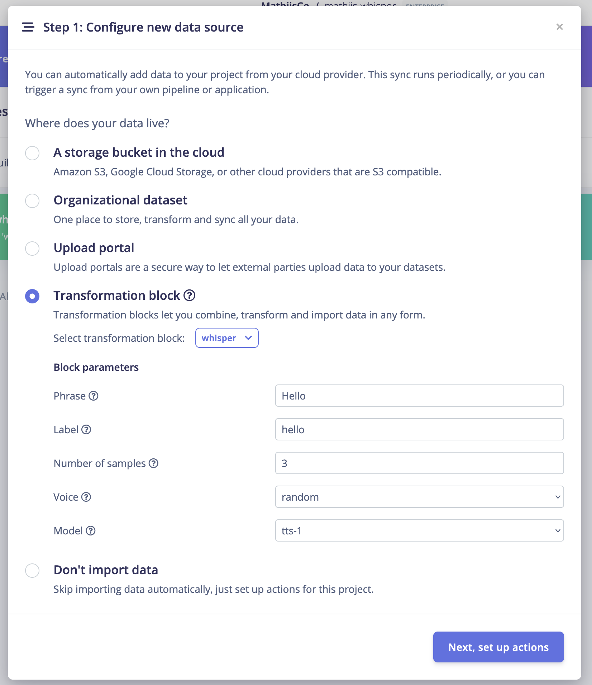
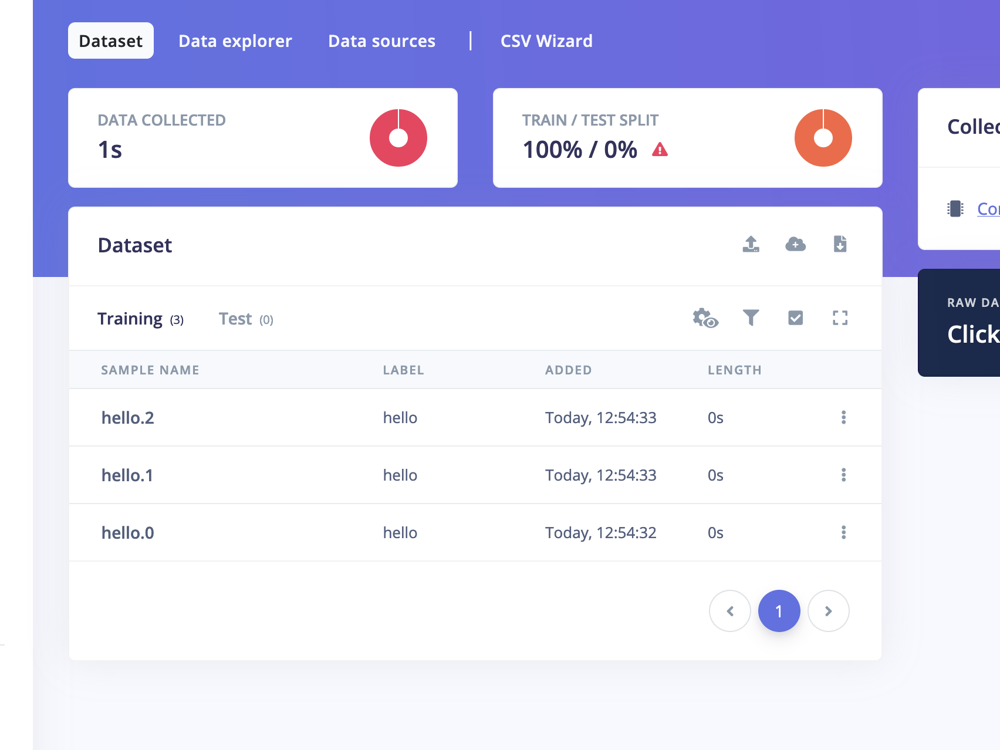

# Whisper Voice Synthesis Block for Edge Impulse

This is a transformation block that uses Whisper to generate synthetic data for your Edge Impulse project.

Input parameters:

`--phrase 'Hello'` Phrase for which to generate voice sample

`--label 'dog_with_hat'` Label to assign

`--samples 3 `  How many unique samples to generate

## How to run (Edge Impulse)

1. You'll need an OpenAI API key:
    * Create an API Key: https://platform.openai.com/docs/api-reference/authentication

2. Add the API key as a secret to your Edge Impulse organization:
    1. Go to your Edge Impulse organization.
    2. Click **Custom blocks > Transformation**
    3. Click **Add new secret**
    4. Set as name: `OPENAI_API_KEY`, as value the API Key you created in step 1.

3. Create a new transformation block:

    ```
    $ edge-impulse-blocks init

    ? Choose a type of block Transformation block
    ? Choose an option Create a new block
    ? Enter the name of your block Whisper Voice Generator
    ? Enter the description of your block Use the Whisper Voice  to generate new images. Takes in --phrase, --label, --sample, --voice and --model
    ? What type of data does this block operate on? Standalone (runs the container, but no files / data items passed in)
    ? Which buckets do you want to mount into this block (will be mounted under /mnt/s3fs/BUCKET_NAME, you can change these mount points in the St
    udio)?
    ? Would you like to download and load the example repository? no
    ```

4. Push the block:

    ```
    $ edge-impulse-blocks push
    ```

5. Go to any project, select **Data acquisition > Data sources > Add new data source > Transformation block** and select this block.

    

6. After you've ran the block you'll have some new audio samples in your project 🚀

    
